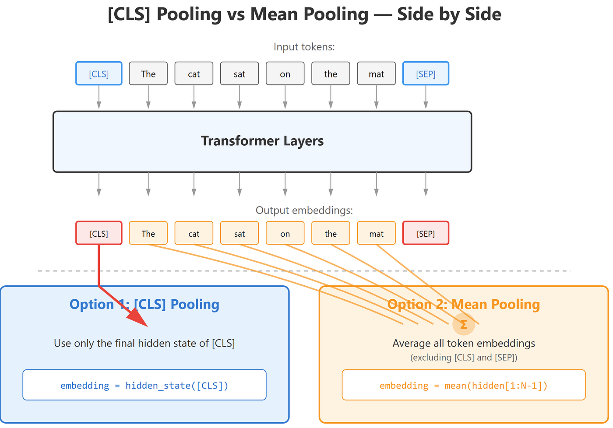
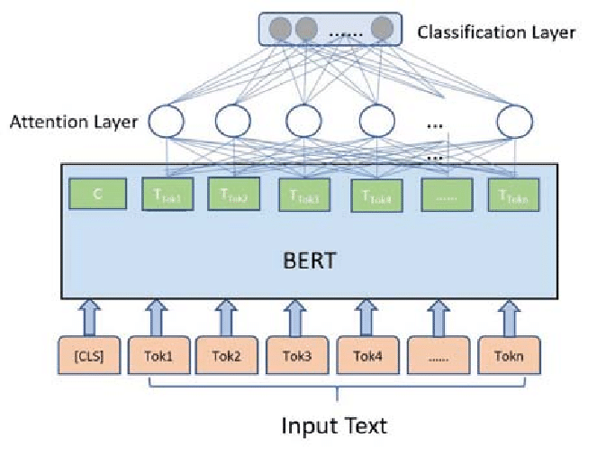

# 모아(MOA) 

## 개요
### 시스템의 목표
모아(MOA)는 `Money Observation & Analysis`를 의미하며, 실제 거래 데이터를 기반으로 소비를 관찰하고 분석하는 자산관리 서비스입니다.
단순한 가계부가 아니라, 목표를 기준으로 소비와 예산을 관리할 수 있도록 돕는 금융 페이스메이커를 지향합니다.
본 시스템은 목표 기반 예산 관리에 초점을 두고 금융 데이터 연동, 소비 분석, 목표 설정, 예산 관리, 추천/코칭, 알림, 데이터 시각화를 제공합니다.

기존 가계부 서비스는 지출 내역을 기록하고 월별 통계를 보여주는 기능에 머무르는 경우가 많았습니다. 하지만 실제 사용자에게 필요한 것은 현재 소비가 목표와 비교해 어느 수준인지, 앞으로 얼마를 더 써도 되는지, 어떤 지출을 먼저 조정해야 하는지에 대한 판단입니다. 모아는 거래 데이터를 기반으로 소비 흐름을 분석하고, 목표 우선순위에 따라 자산 배분과 자유소비 한도를 제안하도록 구성했습니다.

### 서비스가 풀고자 한 문제
기존 가계부 서비스는 지출을 기록하고, 카테고리를 분류하고, 그래프를 보여주는 데서 멈추는 경우가 많습니다. 하지만 사용자는 보통 다음과 같은 질문을 합니다.

- 이번 달에 얼마를 더 써도 되는가
- 지금 속도로 가면 목표를 달성할 수 있는가
- 무엇부터 줄여야 하는가
- 이번 주 소비가 평소보다 과한 이유가 무엇인가

모아는 소비를 기록하는 데서 끝나지 않고, 거래 데이터를 분석하여 목표 달성률, 자유소비 가능 금액, 조정이 필요한 지출 항목을 함께 제시합니다. 이 결과는 알림, 코칭, 시각화와 연결되어 현재 재무 상태를 빠르게 이해할 수 있도록 돕습니다.

## 프로젝트 구조
운영 코드는 `app/` 아래에 두고, 실험과 학습 노트북은 `lab/` 아래에 분리했습니다. 공통 설정과 모델 로더는 `app/core/`에 두고, 실제 기능은 `app/domain/<도메인>/` 아래에 둡니다. 각 도메인은 API, service, repository, entity, agents 단위로 구성하여 역할을 분리했습니다.

```text
app/
├─ main.py                         # FastAPI 엔트리포인트
├─ core/                           # 설정, 로깅, 모델 로더, LLM, DB 공통부
├─ api/                            # DI, 직렬화, 공통 응답 유틸
└─ domain/
   ├─ chatbot/                     # 소비 분석 코칭 AI 에이전트
   ├─ merchant_classification/     # 가맹점명 소비 카테고리 분류
   └─ image_generation/            # 이미지 생성 relay
lab/                               # 학습 노트북과 실험 코드
tests/                             # API, service, notebook 구조 회귀 테스트
docs/plans/                        # 설계와 실행 계획
```

각 도메인은 다음 역할을 담당합니다.

- `app/domain/chatbot/`는 소비 분석 코칭 에이전트와 대화 메모리, 스트리밍 응답을 담당합니다.
- `app/domain/merchant_classification/`은 가맹점명 정규화, 추론, fallback 후처리를 담당합니다.
- `app/domain/image_generation/`은 참조 이미지 다운로드와 외부 이미지 생성 relay를 담당합니다.
- `app/core/`는 설정, 로깅, 모델 로더, LLM 연결처럼 도메인 공통부를 담당합니다.
- `lab/`에는 KoELECTRA 학습 노트북, merchant info augmentation, baseline/v3 비교 실험 코드가 정리되어 있습니다.

서비스 관점에서 보면 구조는 아래와 같습니다.

```text
Flutter App
   ├─ Spring Boot Backend
   │  ├─ 인증/계좌/거래내역/목표/예산
   │  └─ 기존 금융 도메인 비즈니스 로직
   └─ FastAPI AI Server
      ├─ Merchant Classification API
      ├─ Chatbot API
      │  └─ Spring AI MCP -> Spring 금융 로직 재사용
      └─ Image Generation API

External
   ├─ SSAFY 금융 Open API
   ├─ PostgreSQL
   └─ Gemini Image Generation API
```

실제 노출되는 주요 API는 다음과 같습니다.

- `/v1/merchant`, `/v1/merchant/batch`
- `/v1/chatbot/messages`, `/v1/chatbot/messages/stream`
- `/v1/image-generation`

## 기여 내용
### 1. 가맹점명 기반 소비 카테고리 분류 로직과 모델 개발
#### 문제 상황
가맹점명에는 업종을 암시하는 토큰이 앞부분에 위치하는 경우가 많지만, 뒷부분에는 지점명, 지역명, 괄호, 숫자 등 분류에 도움이 되지 않는 정보가 많이 포함됩니다. 또한 소비 분류는 이후 소비 분석과 예산 계산의 기준이 되기 때문에, 같은 입력에 대해 같은 결과를 안정적으로 내는 것이 중요했습니다.

LLM 기반 분류도 검토할 수 있었지만, LLM은 구조적으로 same-input, same-output을 항상 보장하기 어렵습니다. 소비 분석처럼 분류 결과가 후속 계산의 출발점이 되는 영역에서는 이 비결정성이 분석 안정성을 떨어뜨릴 수 있었습니다. 그래서 가맹점명 분류 모델은 LLM 대신 KoELECTRA 기반 분류 구조로 가져갔습니다.

#### 해결 과정
전처리 단계에서는 `NFKC` 정규화, 개행 및 공백 정리, `casefold` 기반 normalized text 생성을 적용했습니다. `NFKC` 정규화는 전각/반각, 호환 문자, 특수문자 표기 차이처럼 눈에는 비슷하지만 내부 표현이 다른 문자열을 최대한 같은 형태로 맞추는 방식입니다. 예를 들어 `ＡＢＣ마트`, `ABC마트`, `ABC  마트`처럼 표기만 다른 입력을 더 비슷한 형태로 정리할 수 있습니다. 목적은 입력을 정리하는 데 있는 것이 아니라, 표기 차이로 인한 분포 흔들림을 줄이는 데 있었습니다.

이를 위해 모델 구조를 기본 KoELECTRA `CLS Pooling` 방식의 분류기에서 `token attention pooling head`로 변경했습니다. KoELECTRA는 한국어 분류 작업에 적합하고, 분류 결과를 안정적으로 재현할 수 있다는 점에서 이 문제에 맞았습니다. 두 방식의 가장 큰 차이는 "문장 전체를 하나의 대표 토큰으로 압축해서 볼 것인가"와 "토큰별 정보를 끝까지 유지한 뒤 중요한 부분만 다시 모을 것인가"에 있었습니다.



기존 `CLS Pooling` 방식은 마지막 hidden state 중 첫 번째 `[CLS]` 토큰 벡터를 문장 전체의 대표 표현으로 사용합니다. 기본 KoElectra가 채택한 방식이기에 사용은 간편했지만, 가맹점명처럼 길이는 짧아도 정보 밀도가 고르지 않은 입력에서는 한계가 있었습니다. 예를 들어 업종을 설명하는 핵심 단어는 앞부분에 있고, 뒷부분에는 지점명, 지역명, 층수, 괄호, 숫자처럼 분류와 직접 관련이 없는 토큰이 섞이는 경우가 많았습니다. 이때 `CLS` 방식은 모든 토큰의 정보를 최종적으로 하나의 벡터에 압축해야 하므로, 어떤 토큰을 더 중요하게 읽어야 하는지가 마지막 분류 단계에서 명시적으로 드러나지 않았습니다. 다시 말해 "전체 문장을 대표하는 하나의 요약 벡터"는 만들 수 있지만, 업종을 결정한 근거 토큰에 더 큰 비중을 두는 읽기 방식은 상대적으로 약했습니다.


반면 `attention pooling head`는 각 토큰의 hidden state에 대해 별도의 score를 계산하고, softmax를 통해 토큰별 가중치를 만든 뒤, 그 가중치로 전체 토큰을 다시 합성합니다. 이 구조에서는 `[CLS]` 하나에 모든 의미를 몰아넣지 않고, `스타벅스`, `다이소`, `약국`, `버거킹`처럼 실제 업종 판단에 기여하는 토큰이 더 큰 weight를 받도록 학습할 수 있습니다. 반대로 `강남점`, `2층`, `(주)`, `B1`, `판교역`처럼 부가 정보에 가까운 토큰은 상대적으로 작은 weight를 받게 됩니다. 즉 `CLS Pooling`이 "요약된 대표 벡터를 바로 분류하는 방식"에 가깝다면, `attention pooling`은 "토큰별 중요도를 한 번 더 계산한 뒤 필요한 정보만 모아서 분류하는 방식"에 가깝습니다. padding token은 attention 계산에서 제외하도록 마스킹도 함께 적용해, 실제 의미가 없는 위치가 pooling 결과에 섞이지 않도록 했습니다.

이 문제에서는 가맹점명의 앞쪽 토큰이 업종을 더 잘 설명하는 경우가 많았고, 뒤쪽으로 갈수록 분기명이나 노이즈가 붙는 패턴이 반복되었습니다. 그래서 입력 전체를 균등하게 압축하는 구조보다, 토큰마다 다른 비중을 둘 수 있는 구조가 더 적합하다고 판단했습니다. KoELECTRA backbone을 사용하면서도 읽는 방식만 바꾸어, 가맹점명 분류에서 필요한 정보와 불필요한 정보를 더 안정적으로 구분할 수 있었습니다.

`MerchantAttentionPoolingClassifier`의 핵심부는 아래와 같습니다.

```python
class MerchantAttentionPoolingClassifier(ElectraPreTrainedModel):
    def __init__(self, config):
        super().__init__(config)
        self.electra = ElectraModel(config)
        self.attention_scorer = nn.Linear(config.hidden_size, 1)
        self.dropout = nn.Dropout(config.hidden_dropout_prob)
        self.classifier = nn.Linear(config.hidden_size, config.num_labels)

    def forward(self, input_ids=None, attention_mask=None, labels=None, **kwargs):
        outputs = self.electra(
            input_ids=input_ids,
            attention_mask=attention_mask,
            return_dict=True,
        )
        hidden_states = outputs.last_hidden_state

        attention_scores = self.attention_scorer(hidden_states).squeeze(-1)
        # 토큰별 중요도를 점수로 계산.

        if attention_mask is not None:
            attention_scores = attention_scores.masked_fill(
                attention_mask == 0,
                torch.finfo(attention_scores.dtype).min,
            )
            # 패딩 토큰은 softmax 대상에서 제외한다.

        attention_weights = torch.softmax(attention_scores, dim=-1)
        pooled_output = torch.einsum("blh,bl->bh", hidden_states, attention_weights)
        # 중요도가 높은 토큰에 더 큰 가중치를 주어 pooling 한다.

        logits = self.classifier(self.dropout(pooled_output))
        # attention pooling 결과로 최종 카테고리를 분류한다.
```

학습 단계에서는 train-time suffix/branch noise augmentation을 추가했습니다. 지점명, 층수, 괄호, 지역명과 같은 접미 노이즈를 일부러 섞어 주어, 모델이 뒤쪽 수식에 과하게 의존하지 않도록 했습니다.

학습 로직은 하나의 공통 함수에서 baseline과 `v3`를 같은 흐름으로 비교하도록 구성했습니다.

```python
def train_and_evaluate_experiment(
    experiment_name,
    model_builder,
    train_dataset_builder,
    eval_dataset_builder,
    train_df_,
    valid_df_,
    test_df_,
):
    model = model_builder(SELECTED_MODEL_NAME)
    # 실험별 모델 구조를 선택한다.

    train_dataset = train_dataset_builder(train_df_, tokenizer, MAX_LENGTH)
    eval_dataset = eval_dataset_builder(valid_df_, tokenizer, MAX_LENGTH)
    # train/eval 데이터셋 전략을 분리한다.

    trainer = build_trainer(
        model=model,
        train_dataset=train_dataset,
        eval_dataset=eval_dataset,
        class_weights=build_class_weights(train_df_),
    )
    # 클래스 불균형을 반영한 Trainer를 구성한다.

    trainer.train()
    trainer.save_model(str(saved_model_dir))
    evaluation_result = evaluate_model_bundle(
        experiment_name=experiment_name,
        model=trainer.model,
        tokenizer_=tokenizer,
        valid_df_=valid_df_,
        test_df_=test_df_,
        dataset_builder=eval_dataset_builder,
    )
    # 학습 후 valid/test와 서비스 fallback 기준까지 함께 평가한다.

    return evaluation_result


baseline_results = train_and_evaluate_experiment(
    experiment_name="baseline",
    model_builder=build_frozen_linear_probe_model,
    train_dataset_builder=build_frozen_baseline_train_dataset,
    eval_dataset_builder=build_frozen_baseline_eval_dataset,
    train_df_=train_df,
    valid_df_=valid_df,
    test_df_=test_df,
)

v3_results = train_and_evaluate_experiment(
    experiment_name="v3",
    model_builder=build_attention_pooling_model,
    train_dataset_builder=build_v3_train_dataset,
    eval_dataset_builder=build_v3_eval_dataset,
    train_df_=train_df,
    valid_df_=valid_df,
    test_df_=test_df,
)
# baseline은 raw merchant text로, v3는 noise augmentation을 포함해 같은 평가 흐름으로 비교한다.
```

운영 후처리에서는 model confidence가 지정한 threshold를 넘지 못하면 fallback label인 `기타서비스`로 분류하도록 했습니다. 잘못된 카테고리를 확정하는 것보다 보수적으로 처리하는 편이, 이후 소비 분석 결과의 신뢰도를 유지하는 데 더 적합하다고 판단했습니다.

#### 결과
baseline과 비교했을 때 `v3`의 `service_test f1_macro`는 `0.7825 -> 0.8308`로 개선되었습니다. 동일한 데이터와 평가 기준에서 약 5%p 수준의 향상을 확인했습니다. 전처리, Attention Pooling Head, noise augmentation, confidence fallback을 함께 적용하여 예측 성능과 분석 안정성을 같이 확보했습니다.

### 2. 소비 분석 코칭 AI 에이전트 개발
#### 문제 상황
초기에는 SQLToolkit 기반 멀티에이전트 구조로 소비 분석을 구성했습니다. 그러나 실제 서비스 데이터와 연결해 보니, 에이전트가 생성한 SQL의 기준과 Spring 서버에 구현된 예산, 지출, 주간 분석 로직의 기준이 일치하지 않는 문제가 있었습니다.

소비 분석은 단순 조회가 아니라 서비스가 정의한 계산식과 정책을 그대로 따라야 하는 영역이었습니다. 모델이 판단을 새로 내릴수록 결과가 달라질 수 있었고, 설명은 맞아 보여도 실제 값은 서비스 기준과 어긋날 수 있었습니다.

#### 해결 과정
SQL 생성 품질을 보정하는 방향 대신, 소비 분석 구조 자체를 Spring 서버 기준으로 다시 정리했습니다. Spring Boot 백엔드에 `spring-ai-starter-mcp-server-webmvc`를 추가하고, 이미 서비스에서 사용 중이던 예산, 자산, 거래, 주간 분석 유스케이스를 Spring AI 기반 read-only finance MCP 서버로 감쌌습니다. 이때 `BudgetMcpQueryAdapter`, `AssetMcpQueryAdapter`, `TransactionMcpQueryAdapter`를 `MethodToolCallbackProvider`에 등록해 기존 금융 도메인 로직을 그대로 MCP 인터페이스로 노출했습니다.

Spring 백엔드의 MCP 등록 코드는 아래와 같은 형태입니다.

```java
// build.gradle
implementation platform("org.springframework.ai:spring-ai-bom:1.1.4")
implementation "org.springframework.ai:spring-ai-starter-mcp-server-webmvc"

// /McpFinanceToolConfiguration.java
@Configuration
@ConditionalOnProperty(prefix = "mcp.finance", name = "enabled", havingValue = "true")
public class McpFinanceToolConfiguration {

    @Bean
    public ToolCallbackProvider financeToolCallbackProvider(
        BudgetMcpQueryAdapter budgetMcpQueryAdapter,
        AssetMcpQueryAdapter assetMcpQueryAdapter,
        TransactionMcpQueryAdapter transactionMcpQueryAdapter
    ) {
        return MethodToolCallbackProvider.builder()
            .toolObjects(budgetMcpQueryAdapter, assetMcpQueryAdapter, transactionMcpQueryAdapter)
            .build();
    }
}

// /BudgetMcpQueryAdapter.java
@Tool(name = "get_budget_home", description = "Returns the main coaching snapshot.")
public BudgetHomeDto.Response getBudgetHome(
    @JsonProperty("user_id") @ToolParam(description = "Internal user identifier") Integer user_id
) {
    return getBudgetHomeUseCase.execute(user_id);
}
```

AI 서버 쪽에서는 기존 SQLToolkit 기반 멀티에이전트 대신 `MORE_FINANCE_MCP_URL`을 바라보는 LangGraph 에이전트로 전환했습니다. `MultiServerMCPClient`로 Spring MCP 엔드포인트를 연결하고, 그래프 실행 시 서버가 검증한 `user_id`를 컨텍스트에 넣어 각 MCP 호출 인자에 주입하도록 구성했습니다. 덕분에 모델은 질문 해석과 응답 생성에 집중하고, 실제 계산은 서비스 기준을 따르는 구조로 역할을 분리할 수 있었습니다.

```python
# app/domain/chatbot/agents/graph.py
async def _load_mcp_tools(self) -> list[BaseTool]:
    client = MultiServerMCPClient(
        {
            "more_finance": {
                "transport": "http",
                "url": self._settings.more_finance_mcp_url,
            }
        }
    )
    return list(await client.get_tools())

def _build_context(input: dict[str, Any]) -> ChatbotAgentContext:
    return ChatbotAgentContext(
        user_id=int(input.get("user_id") or 0),
        session_id=str(input.get("session_id") or ""),
        user_query=str(input.get("user_query") or _latest_human_text(input.get("messages"))),
    )

def _inject_user_id(self, request):
    tool_call = _normalized_tool_call(getattr(request, "tool_call", None))
    tool = getattr(request, "tool", None)
    if tool_call is not None and _tool_accepts_user_id(tool):
        args = dict(tool_call.get("args") or {})
        args["user_id"] = request.runtime.context.user_id
        tool_call["args"] = args
    return request.override(tool_call=tool_call)
```

운영 측면에서는 MCP를 read-only 조회 계층으로 제한해 원본 데이터 변경을 막았고, 스트리밍 응답과 conversation summary memory를 함께 적용해 긴 대화에서도 문맥을 안정적으로 유지하도록 했습니다.

#### 결과
소비 분석 코칭은 SQL을 직접 생성해 해석하는 구조에서, Spring 서버의 금융 정책을 Spring AI MCP로 연결한 에이전트 구조로 전환했습니다. 분석 결과와 서비스 기준 사이의 차이를 줄였고, 예산/지출/주간 분석의 계산 근거를 사용자에게 더 일관되게 설명할 수 있게 되었습니다.

### 3. AI 이미지 생성 엔드포인트 연결
#### 문제 상황
이미지 생성은 단순히 URL을 받아 바로 모델에 전달하는 방식으로는 안정적으로 운영하기 어렵습니다. 참조 이미지의 접근 가능 여부, MIME 타입, 생성 모델이 기대하는 payload 구조를 중간에서 검증해야 했습니다.

#### 해결 과정
`ImageGenerationService`는 공개 이미지 URL을 먼저 다운로드하고, content-type을 확인한 뒤 base64로 변환하여 생성 그래프에 전달합니다. 이후 `build_image_generation_graph()`가 prompt와 image payload를 조립하고 외부 생성 API로 relay합니다.

이 구조를 사용한 이유는 사용자 프롬프트와 참조 이미지를 그대로 전달하는 것보다, 중간에서 의도를 정리한 뒤 넘기는 편이 실패를 줄이기 쉽기 때문입니다. 또한 다운로드 실패, content-type 오류, upstream 생성 API 오류를 분리하여 확인할 수 있도록 처리 경로를 나누었습니다.

대표 시스템 프롬프트 예시는 아래와 같습니다.

```text
You create concise, production-ready prompts for Gemini image generation models.

- Preserve recognizable identity cues from the profile image, such as face shape,
  hairstyle direction, hair color, skin tone, glasses, and overall likeness.
- Do not preserve the original photo style; reinterpret the subject as a stylized
  animated character.
- Combine the subject from the profile image with the user's goal into one coherent
  final scene.
- Always render the final image in a polished Pixar-style 3D animated look.
- If the user mentions a brand or product model, express it through silhouette,
  materials, and industrial design cues rather than visible text.
- Do not generate readable text, logos, model names, watermarks, captions,
  UI overlays, stickers, badges, or speech bubbles.
- Always target square 1:1 composition and one single final image only.
```

요약하면 아래 방향으로 이미지 생성을 유도했습니다.

- 참조 이미지는 사용자의 정체성을 유지하는 기준으로만 사용했습니다.
- 사용자 프롬프트는 장면, 역할, 분위기, 소품을 결정하는 목표 입력으로 사용했습니다.
- 최종 결과는 Pixar-style 3D animated character 느낌으로 통일했습니다.
- 브랜드나 제품명은 텍스트 대신 형태와 재질, 디자인 언어로 표현하도록 유도했습니다.
- 텍스트, 로고, 워터마크, 말풍선, UI overlay는 생성되지 않도록 강하게 제어했습니다.
- 결과물은 1:1 비율의 단일 이미지로 제한했습니다.

#### 결과
이미지 생성 기능은 단순 proxy가 아니라 입력 검증과 생성 relay가 분리된 구조로 정리했습니다. 이후 다른 생성 모델로 교체하더라도 URL 다운로드와 payload 조립 범위만 수정하면 되도록 구성했습니다.

### 화면 시안
#### 메인 화면
<!-- 메인 화면 이미지 추가 예정 -->

#### 소비 분석 화면
<!-- 소비 분석 화면 이미지 추가 예정 -->

#### 가맹점 분류 화면
<!-- 가맹점 분류 화면 이미지 추가 예정 -->

#### 이미지 생성 화면
<!-- 이미지 생성 화면 이미지 추가 예정 -->

## 실행 방법
```bash
python -m uv sync --extra dev
python -m uv run uvicorn app.main:app --host 0.0.0.0 --port 8000
```

실행 시에는 `AI_API_KEY`, `OPENAI_BASE_URL`, `MORE_FINANCE_MCP_URL`, `GOOGLE_AI_BASE_URL` 같은 환경변수가 필요할 수 있습니다. 세부 실행 메모는 [run.md](./run.md)를 참고하면 됩니다.

## 관련 문서
- [README.example.md](./README.example.md)
- [run.md](./run.md)
- [MOA README 설계 문서](./docs/plans/2026-04-01-moa-readme-design.md)
- [MOA README 구현 계획](./docs/plans/2026-04-01-moa-readme.md)
- [가맹점 분류 v3 정렬 문서](./docs/plans/2026-04-01-merchant-classifier-v3-alignment.md)
- [가맹점 분류 frozen baseline vs v3 계획](./docs/plans/2026-03-29-koelectra-frozen-baseline-vs-v3-plan.md)
- LangGraph MCP 사용 문서: `../more-be/BE/amagetdone/LANGGRAPH_MCP_USAGE.md`
